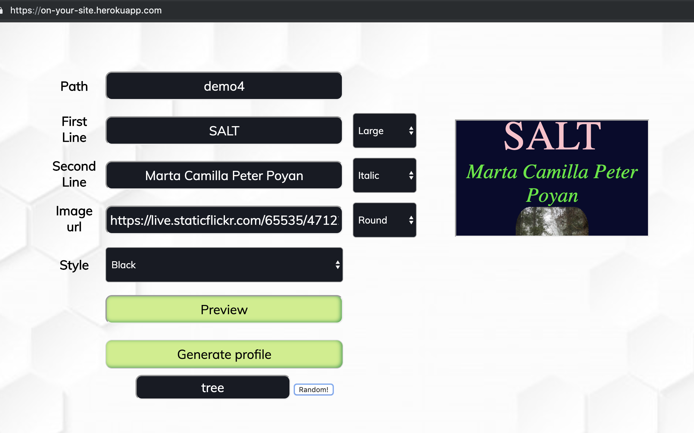

# ImYourSite

https://on-your-site.herokuapp.com/

A basic website creator

Nodejs, Expressjs, Mongodb

### Contributing 

fork the repo, clone it and run npm install

project works with MongoDB, so it is recommended that you have it installed and running on your machine.
> NODE_ENV=production node index.js

You can also create an account and get a free cluster: https://cloud.mongodb.com
> MONGOLAB_URI=/your mongo uri/ NODE_ENV=production node index.js

You can also run it in 'development' mode, but Mocks are setup only for webpage creation, not login  
> node index.js
